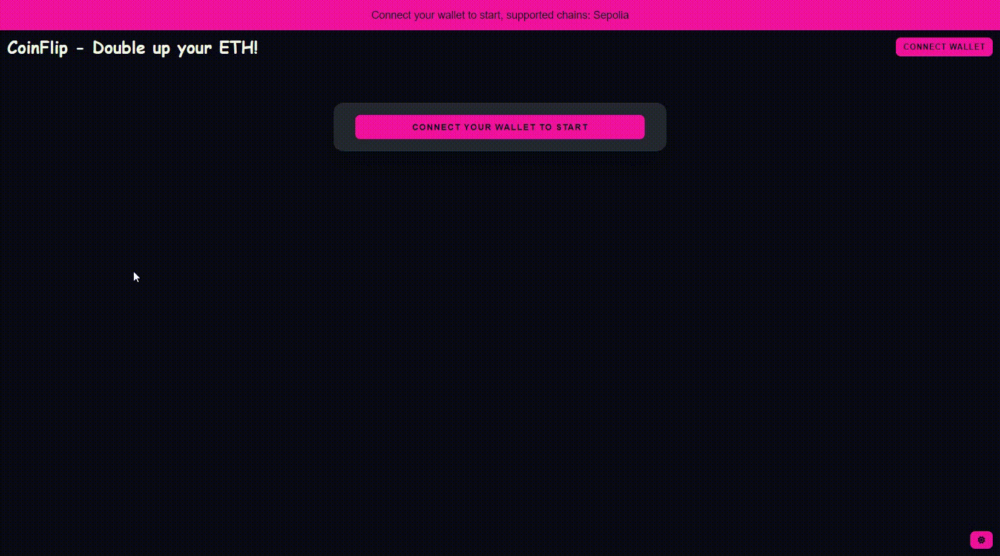
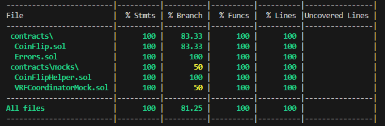

<div align="center">
<h1><strong> CoinFlip - Double up your ETH! </strong></h1>




## Table of Contents

- [Table of Contents](#table-of-contents)
- [Description](#description)
- [Built With](#built-with)
- [Getting Started](#getting-started)
  - [Prerequisites](#prerequisites)
  - [Smart-Contracts Deployment](#smart-contracts-deployment)
    - [Install the dependencies](#install-the-dependencies)
    - [Deployement](#deployement)
    - [Coverage](#coverage)
    - [Static Analyzer](#static-analyzer)
  - [Config \& Client](#config--client)
- [Acknowledgments](#acknowledgments)
- [Use](#use)
  


## Description

The app is a simple coin flip game where you can double up your ETH or lose your bet. The game is based on a smart contract that uses Chainlink VRF to generate a random number.

Smart contracts deployed on Sepolia testnet: [0x097d039Bb7353B0bcD3d585B5a71e8B575F2f3f7](https://sepolia.etherscan.io/address/0x097d039Bb7353B0bcD3d585B5a71e8B575F2f3f7#code)

Try it yourself: [coinflip-double-up-your-eth.netlify.app/](https://coinflip-double-up-your-eth.netlify.app/)

## Built With

- [![React][react.js]][react-url]
- [![solidity]][solidity-url]
- [![chainlink]][chainlink-url]
- [![hardhat]][hardhat-url]
- [![ethers.js]][ethers-url]

## Getting Started

### Prerequisites

Make sure you have the following ready:

- [node.js](https://nodejs.org/) installed (developed on LTS v20.12.0)
- [yarn](https://yarnpkg.com/) installed
- [hardhat](https://hardhat.org/) installed
- [MetaMask](https://metamask.io/) installed in your browser


### Smart-Contracts Deployment

#### Install the dependencies

In your terminal, make sure you are in the `COINFLIP_2.0` repo, then move to the blockchain folder :

```bash
cd blockchain
```

Then run the following command to install the dependencies:

```bash
yarn install
```

#### Deployement

To deploy your smart-contracts:

- Subscribe to Chainlink VRF v2.5 on the [Chainlink VRF Sepolia dashboard](https://vrf.chain.link/sepolia/). You can get some test LINK there: [LINK Faucet](https://faucets.chain.link/).
- Add your <b>subscription id</b> to the deployment script in `blockchain/scripts/deploy.js`. To deploy on different chains, you will also have to adjust the `COORDINATOR` and `KEY_HASH` values. You can refer to the [Chainlink docs](https://docs.chain.link/vrf/v2-5/supported-networks#configurations) to get the data for the desired network (if supported).
- Also, make sure that the network is configured in `hardhat.config.js` and that you have defined the required variables in the `.env` file.
- Edit the script in `blockchain/package.json` to deploy the contract on the network of your choice.
- Finally, run the command below to deploy to the network of your choice.

```bash
yarn deploy
```

#### Coverage

To check the coverage of the tests, run the following command:

```bash
yarn cover
```

And see the results printed in the terminal:



#### Static Analyzer

For basic security checks, you can run both [Slither](https://github.com/crytic/slither) and [Aderyn](https://github.com/Cyfrin/aderyn) (refer to their doc to install them) with the following commands:

```bash
yarn slither
```

```bash
yarn aderyn
```

Aderyn will print a nice report file called `report.md` at the root of the project.

### Config & Client

Before each deployment, make sure to:

- Replace the contract address in `src/data/constants.js`
- Replace the abi file in `src/data/coinFlipAbi.js`
- Make sure to fund the contract with some ETH ( [Faucet for the Sepolia network](https://goerlifaucet.org/) )

---

- Change the `COINFLIP_ADDRESS` in `/src/constants.js` to your deployed contracts address;
- Copy the new abi file into the `src/abis` folder if you've made any changes to the contracts;
- Enable/disable, and update the suitable networks in `truffle-config.js`;
- In the `blockchain/` repo, create a file called `.secret` and paste your mnemonic seed phrase inside; (<b>Make sure you add this file in your `.gitignore`!!!</b>)

<!-- ACKNOWLEDGMENTS -->

## Acknowledgments

- [Img Shields](https://shields.io)
- [Font Awesome](https://fontawesome.com)

## Use

You are now set to start your local server. Make sure you're still in `COINFLIP 2.0` and type:
`yarn start`

<br/>

<div align="center">
<h2># Enjoy!!!</h2>


</div>

<p align="right">(<a href="#top">back to top</a>)</p>


